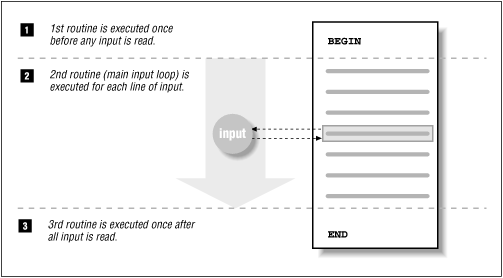
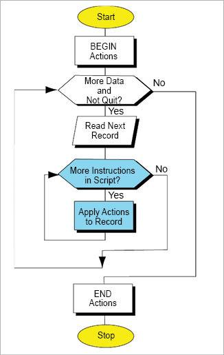

# AWK crashcourse

AWK language course aims to explain AWK in 15 minutes to let you find [awesome tool friend](https://github.com/freznicek/awesome-awk) despite it's given name. The correct pronunciation is [[auk] after smaller seabirds Parakeet auklets](https://en.wikipedia.org/wiki/Auk).

## General language description

AWK language (is):
 * (mainly) text processing language
 * available on most UNIX-like systems by default, on Windows there is either native binary or cygwin one
 * syntax is influenced by `c` and `shell` programming languages
 * programs from single line to multiple library files
 * several implementations available, notably `gawk` and `mawk`
 * solves generaly same problems as similar text-processing tools `sed`, `grep`, `wc`, `tr`, `cut`, `printf`, `tail`, `head`, `cat`, `tac`, `bc`, `column`, ...

AWK language use-cases are:
 * computing int / floating point math formulas (based on input)
 * general text-processing
   * cutting pieces from input text stream
   * reformatting input text stream
 * (shell) meta-programming generator

AWK language capabilities:
 * text-processing functions
 * regular expression support
 * math functions
 * dynamic typing, support for
   * integer / long
   * floats
   * associative arrays (including multi-dimensional array support)
 * external execution support


## Processing workflow aka `main()`
Every AWK execution consist of folowing three phases:
 * [1] `BEGIN{ ... }` are actions performed at the beginning *before first text character* is read
   * multiple blocks allowed (normally single)
 * [2] `[condition]{ ... }` are actions performed *on every* `AWK record` (default text line)
   * every `AWK record` is automatically split into `AWK fields` (by default words)
   * multiple blocks allowed
 * [3] `END{ ... }` are actions performed at the end of the execution  *after last text character is read*
   * multiple blocks allowed (normally single)





### warm-up basic example

```awk
$ echo -e "AWK is still useful\ntext-processing  technology!" | \
>   awk 'BEGIN{wcnt=0;print "lineno/#words/3rd-word:individual words\n"}
>             {printf("% 6d/% 6d/% 8s:%s\n",NR,NF,$3,$0);wcnt+=NF}
>          END{print "\nSummary:", NR, "lines/records,", wcnt, "words/fields"}'
lineno/#words/3rd-word:individual words

     1/     4/   still:AWK is still useful
     2/     2/        :text-processing  technology!

Summary:2 lines/records, 6 words/fields
```

## Command-line basics

* Passing text data to AWK:
  * from pipe: `cat input-data.txt | awk <app>`
  * from file[s] read by awk itself: `awk <app> input-data.txt`

* AWK application execution styles (`-f`):
  * on command-line `awk '{ ... }' input-data.txt`
  * in separate files `awk -f myapp.awk input-data.txt`

* specifying an AWK variable on command-line `-v var=val`
* specifying `AWK field` separator `FS` variable or `-F <FS>` switch
 
## Global variables
[Global variables are documented here](https://www.gnu.org/software/gawk/manual/html_node/User_002dmodified.html), most common ones are:
 * `$0` value of current `AWK record` (whole line without line-break)
   * `$1`, `$2`, ... `$NF` values of first, second, ... last `AWK field` (word)
 * `FS` Specifies the input `AWK field` separator, i.e. how AWK breaks input record into fields (default: a whitespace).
 * `RS` Specifies the input `AWK record` separator, i.e. how AWK breaks input stream into records (default: an universal line break).
 * `OFS` Specifies the output separator, i.e. how AWK print parsed fields to the output stream using `print()` (default: single space).
 * `ORS` Specifies the output separator, i.e. how AWK print parsed records to the output stream using `print()` (default: line break)
 * `FILENAME` contains the name of the input file read by awk (read only global variable)

## Buildin functions
[AWK functions are documented](https://www.gnu.org/software/gawk/manual/html_node/Functions.html), the most important ones are:
 * `print`, `printf()` and `sprintf()`
   * printing functions
 * `length()`
   * length of an string argument
 * `substr()`
   * splitting string to a substring
 * `split()`
   * split string into an array of strings
 * `index()`
   * find position of an substring in a string
 * `sub()` and `gsub()`
   * (regexp) search and replace (once respectivelly globally)
 * `~` operator and `match()`
   * regexp search
 * `tolower()` and `toupper()`
   * convert text to lowercase resp. uppercase

## Learn by examples
 * [Hello world](examples/hello-world.md)
 * [Word count using wc and awk](examples/word-count.md)
 * [Pattern search using grep and awk](examples/pattern-search-count.md)
 * [Uniq words in awk](examples/uniq-words.md)
 * [Computing the average](examples/average.md)
 * [Text stream FSM machine](examples/text-fsm.md)
 * [Manipulation with text columns](examples/column-modifications.md)
 * [Shell metaprogramming with awk](examples/shell-metaprogramming.md)
 * [Why is cut very limited to awk](examples/cut-vs-awk.md)
 * [Memory hungry application](examples/memory-hungry.md)
 * [CPU intensive application](examples/cpu-intensive.md)
 * [Debugging / profiling AWK application](examples/profiling.md)
 * [GNU AWK network programing](examples/gawk-web-server.md)
 * [30 seconds of AWK code](https://github.com/freznicek/30-seconds-of-awk-code/blob/master/README.md)


## Best practices

### Portability

Prefer general `awk` before an specific AWK implementation:
 * use general `awk` for portable programs
 * otherwise use the particular implementation e.g. `gawk`

### AWK programs extension and readability

General rule of thumb is to create AWK program as a `*.awk` file if equivalent one-liner is not well readable.

If you have troubles to understand one line awk program then feel free to use GNU AWK's [profiling functionality](examples/profiling.md) i.e. `-p` option to receive pretty printed AWK code (in `awkprof.out`).

### Code quality
 * comment properly
 * indent similarly as in c/c++ programmimng languages
 * use functions whenever possible
 * stay explicit avoiding [awk default (implicit) actions](https://www.gnu.org/software/gawk/manual/html_node/Intro-Summary.html#Intro-Summary) which make AWK application hard to understand
   * example: `length > 80` should be rather written `'length($0) > 80 { print }'` or `'length($0) > 80 { print $0 }'`

### Pitfalls
 * don't forget to always use apostrophe `'` quotation when writing awk oneline applications to avoid shell expansion (for instance `$1`)
   * `awk "{print $1}"` should be `awk '{print $1}'`
 * old awk implementations are limited (old `awk` and also `nawk`) use one of [recommended ones](https://github.com/freznicek/awesome-awk/blob/master/README.md#nowadays-awk-implementations)
 * string / array indexing from `1` (`index()`, `split()`, `$i`, ...)
 * GNU AWK implementation understand localization & utf-8/unicode and thus replacing with `[g]sub()` can lead to unwanted behavior unless you force gawk to drop such support via exporting environment variable `LC_ALL=C`
   * other awk implementations may not support utf-8/unicode:
```
# awk implementation versions
GNU Awk 4.1.3, API: 1.1 (GNU MPFR 3.1.5, GNU MP 6.1.1)
mawk 1.3.4 20161107
BusyBox v1.22.1 (2016-02-03 18:22:11 UTC) multi-call binary.

$ echo "Zřetelně" | gawk '{print toupper($0)}'
ZŘETELNĚ
$ echo "Zřetelně" | mawk '{print toupper($0)}'
ZřETELNě
$ echo "Zřetelně" | busybox awk '{print toupper($0)}'
ZřETELNě

```
 * extended reqular expressions are available just for gawk (and for older version has to be explicitly enabled):
```
$ ps auxwww | gawk '{if($2~/^[0-9]{1,1}$/){print}}'
root         1  0.0  0.0 197064  4196 ?        Ss   Oct31   2:21 /usr/lib/systemd/systemd --switched-root --system --deserialize 24
root         4  0.0  0.0      0     0 ?        S<   Oct31   0:00 [kworker/0:0H]

$ ps auxwww | gawk --re-interval '{if($2~/^[0-9]{1,1}$/){print}}'
root         1  0.0  0.0 197064  4196 ?        Ss   Oct31   2:21 /usr/lib/systemd/systemd --switched-root --system --deserialize 24
root         4  0.0  0.0      0     0 ?        S<   Oct31   0:00 [kworker/0:0H]

$ ps auxwww | mawk '{if($2~/^[0-9]{1,1}$/){print}}'
$
```

## [Additional resources](https://github.com/freznicek/awesome-awk/blob/master/README.md)

